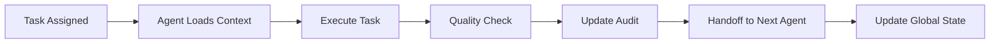

# CFlex Agent-Based Development Orchestration
**Version**: 2.0  
**Date**: August 23, 2025  
**Updated Structure**: 8 Specialized Coding Agents

---

## Executive Summary

The CFlex platform development has been restructured around **8 specialized AI coding agents**, each with focused expertise, individual workspaces, memory systems, and audit trails. This approach ensures:

- **Atomic Task Execution**: Each agent receives self-contained, executable tasks
- **Parallel Development**: Multiple agents work simultaneously on independent tasks  
- **Quality Assurance**: Built-in audit trails and memory systems prevent knowledge loss
- **Clear Dependencies**: Explicit handoff protocols between agents
- **Scalable Coordination**: Global workflow orchestration with automated dependency management

## Agent Architecture

### 🏗️ Agent 1: Database Architect
- **Focus**: MySQL schema design, migrations, performance optimization
- **Current Task**: `T-001-DB-FOUNDATION` (Core schema for orders, products, files)
- **Workspace**: `agents/agent-1-database/`
- **Next**: Dynamic pricing tables and inventory schema

### 🔧 Agent 2: Backend API Developer  
- **Focus**: REST APIs, business logic, Rise CRM integration
- **Status**: Waiting for database schema completion
- **Next Task**: `T-002-API-ORDERS` (Order management APIs)
- **Integration**: Must extend Rise CRM without core modifications

### 📁 Agent 3: File Processing Specialist
- **Focus**: Image processing, TIFF→JPG conversion, storage tiering
- **Capabilities**: Sharp.js, ImageMagick, cPanel SFTP integration
- **Performance Target**: 90% of <50MB files processed in <60s
- **Storage Strategy**: VPS hot → cPanel cold tier automation

### 🎨 Agent 4: Frontend UI Developer
- **Focus**: Angular/React components, responsive design, accessibility
- **Standards**: WCAG 2.1 AA compliance, bilingual UI (EN/Nepali)  
- **Next**: UI mockups and component library foundation
- **Integration**: Will consume APIs from Agent 2

### 🔌 Agent 5: Integration Engineer
- **Focus**: WhatsApp proxy, email services, third-party APIs
- **Critical System**: Baileys-based WhatsApp integration with email fallback
- **Responsibilities**: Message queuing, template management, webhook handling
- **Risk Management**: Built-in failover and monitoring systems

### 📊 Agent 6: Monitoring Specialist
- **Focus**: Prometheus, Grafana, Loki, alerting systems
- **Architecture**: Lightweight stack optimized for single VPS deployment
- **Dashboards**: Business metrics, system health, agent performance tracking
- **Integration**: Collects metrics from all other agents

### ✅ Agent 7: Testing Automation Engineer
- **Focus**: Unit tests, integration tests, E2E testing, performance testing
- **Coverage Target**: >85% for critical paths
- **Tools**: Jest, PHPUnit, Selenium, JMeter
- **Responsibility**: Quality gates for all agent deliverables

### 🚀 Agent 8: DevOps Engineer
- **Focus**: CI/CD pipelines, deployment automation, infrastructure
- **Initial Task**: Development environment setup
- **Tools**: GitHub Actions, Ansible, Docker (where applicable)
- **Security**: Automated security scanning and hardening

## Coordination System

### Global Workflow Orchestration
- **Task Board**: `agents/shared/task_board.json` - Real-time project status
- **Communication**: `agents/COMMUNICATION_PROTOCOL.md` - Inter-agent messaging
- **Dependencies**: Automated detection and resolution of blocking dependencies
- **Quality Gates**: Built-in checkpoints before task handoffs

### Agent Memory & Audit System
Each agent maintains:
- **Context Memory**: `memory/context.json` - Current state and learned patterns  
- **Audit Logs**: `audit/task_log.json` - Complete task completion history
- **Artifacts**: `artifacts/` - All deliverables with versioning
- **Communication**: Individual inboxes for agent-to-agent messaging

### Task Execution Flow

## Current Project Status

### Phase 1: Foundation (Weeks 1-2)
**Critical Path**: Database → APIs → Development Environment

**Active Tasks**:
- `T-001-DB-FOUNDATION`: Agent-1 creating core database schema
- `T-006-MONITORING-SETUP`: Agent-6 can work in parallel  
- `T-007-TEST-FRAMEWORK`: Agent-7 can work in parallel
- `T-008-DEV-ENV`: Agent-8 can work in parallel

**Dependencies**:
- Agent-2 (APIs) blocked until Agent-1 completes database schema
- Agent-4 (Frontend) can start with mockups, blocked on APIs for integration
- Agent-3 (File Processing) can work independently
- Agent-5 (Integration) can work on WhatsApp proxy independently

### Key Improvements from Agent-Based Approach

1. **Parallel Execution**: 4 agents can work simultaneously in Phase 1
2. **Specialization**: Each agent is an expert in their domain
3. **Knowledge Retention**: Memory systems prevent knowledge loss
4. **Quality Assurance**: Built-in audit trails and quality gates
5. **Fault Tolerance**: Agents can be replaced without losing project state
6. **Scalability**: Easy to add more agents for complex tasks

## Integration with Existing Documentation

### Reference Architecture (Adapted)
- **PRD/consolidate v3.md**: Requirements decomposed into agent-specific tasks
- **Rise CRM 3.9.3**: Used as reference, not modified directly  
- **Ever-Gauzy**: Patterns adapted for CFlex-specific implementation
- **Open Source Components**: Evaluated and integrated by relevant agents

### Repository Structure (Enhanced)
The original 8-repository architecture remains, but now each agent has clear ownership:
- `cflex-core-platform`: Shared ownership (Agents 1, 2, 4)
- `cflex-rise-customizations`: Agent 2 primary
- `cflex-monitoring-system`: Agent 6 primary  
- `cflex-storage-manager`: Agent 3 primary
- `cflex-file-processor`: Agent 3 primary
- `cflex-whatsapp-proxy`: Agent 5 primary
- `cflex-bagisto-sync`: Agent 5 secondary
- `cflex-infrastructure`: Agent 8 primary

## Next Steps for Implementation

### Immediate Actions (Next 24 Hours)
1. **Agent-1**: Begin `T-001-DB-FOUNDATION` - Create core database schema
2. **Agent-6**: Start `T-006-MONITORING-SETUP` - Deploy Prometheus/Grafana  
3. **Agent-7**: Initialize `T-007-TEST-FRAMEWORK` - Set up testing infrastructure
4. **Agent-8**: Execute `T-008-DEV-ENV` - Configure development environment

### Week 1 Goals
- Foundation database schema complete and tested
- Development environment ready for all agents
- Basic monitoring infrastructure deployed  
- Testing framework established
- Agent coordination protocols proven effective

### Success Metrics
- **Task Completion Rate**: >95% of assigned tasks completed on time
- **Quality Score**: >90% first-time acceptance rate
- **Communication Efficiency**: <4 hour average response time for agent requests
- **Dependency Resolution**: <24 hours average time to resolve blockers

This agent-based approach transforms the CFlex development from a traditional single-team effort into a coordinated multi-agent system, enabling faster development, better quality, and more reliable knowledge retention throughout the project lifecycle.
