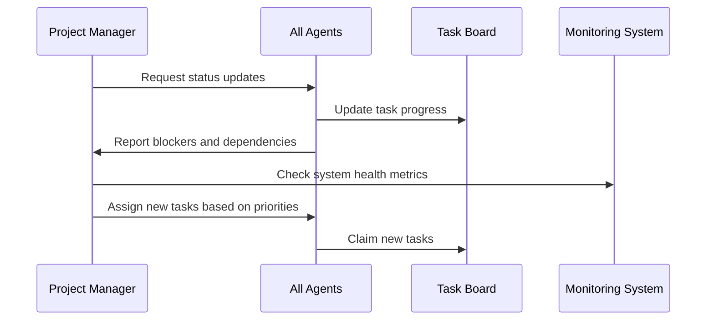

# CFlex Agent Task Templates & Coordination Framework
**Version: 1.0**  
**Date: August 22, 2025**

---

## Agent Task Template System

### Template 1: Backend Core Agent Tasks

#### Task Template: API Endpoint Development
```yaml
task_type: "backend_api_development"
priority: "high"
estimated_hours: 8-16
dependencies: ["database_schema", "authentication_module"]

specifications:
  - endpoint_path: "/api/v1/{resource}"
  - http_methods: ["GET", "POST", "PUT", "DELETE"]
  - authentication_required: true
  - rate_limiting: "100 requests/minute"
  - response_format: "JSON"
  - error_handling: "RFC 7807 compliant"

deliverables:
  - source_code: "controllers/{resource}_controller.php"
  - unit_tests: "tests/unit/{resource}_test.php"
  - api_documentation: "docs/api/{resource}.md"
  - postman_collection: "tests/postman/{resource}.json"

success_criteria:
  - code_coverage: ">85%"
  - response_time: "<200ms"
  - security_scan: "no vulnerabilities"
  - documentation_completeness: "100%"

testing_requirements:
  - unit_tests: "all business logic covered"
  - integration_tests: "database interactions"
  - security_tests: "SQL injection, XSS prevention"
  - performance_tests: "load testing with 30 concurrent users"
```

#### Task Template: Database Schema Implementation
```yaml
task_type: "database_schema"
priority: "critical"
estimated_hours: 4-8
dependencies: ["requirements_analysis"]

specifications:
  - database_engine: "MySQL 8.0+"
  - migration_framework: "CodeIgniter 4 Migrations"
  - indexing_strategy: "query optimization focused"
  - foreign_key_constraints: "enforced"

deliverables:
  - migration_files: "database/migrations/{timestamp}_{table_name}.php"
  - rollback_scripts: "database/rollbacks/{timestamp}_{table_name}.php"
  - erd_diagram: "docs/database/erd.png"
  - data_dictionary: "docs/database/data_dictionary.md"

success_criteria:
  - migration_success: "100% up and down"
  - query_performance: "<100ms for standard operations"
  - data_integrity: "no orphaned records"
  - backup_compatibility: "verified"
```

### Template 2: Frontend Experience Agent Tasks

#### Task Template: Component Development
```yaml
task_type: "frontend_component"
priority: "medium"
estimated_hours: 6-12
dependencies: ["ui_mockups", "api_endpoints"]

specifications:
  - framework: "Angular 16+"
  - styling: "Bootstrap 5 + Custom CSS"
  - responsiveness: "mobile-first design"
  - accessibility: "WCAG 2.1 AA compliant"
  - internationalization: "English/Nepali support"

deliverables:
  - component_files: "src/app/components/{component}/"
  - template_file: "{component}.component.html"
  - style_file: "{component}.component.scss"
  - typescript_file: "{component}.component.ts"
  - test_file: "{component}.component.spec.ts"

success_criteria:
  - mobile_responsiveness: ">95% score"
  - accessibility_audit: "no violations"
  - performance_score: ">90% lighthouse"
  - user_testing: ">90% task completion rate"

testing_requirements:
  - unit_tests: "component logic"
  - e2e_tests: "user interactions"
  - accessibility_tests: "screen reader compatibility"
  - cross_browser_tests: "Chrome, Firefox, Safari, Edge"
```

### Template 3: Integration Specialist Agent Tasks

#### Task Template: Third-Party Integration
```yaml
task_type: "third_party_integration"
priority: "high"
estimated_hours: 12-20
dependencies: ["api_documentation", "authentication_setup"]

specifications:
  - integration_type: "REST API / GraphQL / Webhook"
  - authentication: "OAuth 2.0 / API Key / JWT"
  - rate_limiting: "respect provider limits"
  - error_handling: "exponential backoff retry"
  - monitoring: "health checks and alerting"

deliverables:
  - integration_service: "src/services/{provider}_service.ts"
  - configuration_file: "config/{provider}.config.ts"
  - error_handlers: "src/handlers/{provider}_error.ts"
  - monitoring_setup: "monitoring/{provider}_health.ts"
  - documentation: "docs/integrations/{provider}.md"

success_criteria:
  - uptime: ">99.5%"
  - error_rate: "<0.1%"
  - response_time: "<500ms"
  - failover_time: "<30 seconds"

testing_requirements:
  - integration_tests: "live API testing"
  - mock_tests: "offline functionality"
  - error_simulation: "network failures"
  - load_tests: "rate limit compliance"
```

### Template 4: DevOps Infrastructure Agent Tasks

#### Task Template: CI/CD Pipeline Setup
```yaml
task_type: "cicd_pipeline"
priority: "critical"
estimated_hours: 16-24
dependencies: ["repository_structure", "environment_setup"]

specifications:
  - platform: "GitHub Actions"
  - environments: ["development", "staging", "production"]
  - deployment_strategy: "blue-green / rolling"
  - rollback_capability: "automatic on failure"

deliverables:
  - workflow_files: ".github/workflows/{environment}.yml"
  - deployment_scripts: "scripts/deploy/{environment}.sh"
  - rollback_scripts: "scripts/rollback/{environment}.sh"
  - monitoring_setup: "scripts/monitoring/health_check.sh"

success_criteria:
  - deployment_success_rate: ">98%"
  - deployment_time: "<5 minutes"
  - rollback_time: "<2 minutes"
  - zero_downtime: "verified"

testing_requirements:
  - pipeline_tests: "all stages functional"
  - deployment_tests: "successful to all environments"
  - rollback_tests: "verified functionality"
  - security_scans: "integrated in pipeline"
```

---

## Agent Coordination Workflows

### Daily Coordination Protocol

#### Morning Standup Workflow


#### Task Dependency Resolution
```yaml
dependency_resolution_protocol:
  - check_prerequisites: "verify all dependencies completed"
  - notify_waiting_agents: "alert dependent agents when ready"
  - update_task_board: "mark dependencies as resolved"
  - trigger_next_phase: "automatically start dependent tasks"
```

### Weekly Review Process

#### Code Review Workflow
```yaml
code_review_process:
  submission:
    - create_pull_request: "with detailed description"
    - assign_reviewers: "minimum 2 agents"
    - run_automated_tests: "CI/CD pipeline"
    - security_scan: "automated vulnerability check"
  
  review:
    - functionality_review: "business logic correctness"
    - code_quality_review: "adherence to standards"
    - performance_review: "efficiency analysis"
    - security_review: "vulnerability assessment"
  
  approval:
    - all_reviewers_approve: "unanimous decision required"
    - automated_tests_pass: "100% success rate"
    - security_scan_clear: "no critical vulnerabilities"
    - documentation_complete: "adequate coverage"
```

### Sprint Planning Framework

#### Sprint Capacity Planning
```yaml
sprint_planning:
  duration: "2 weeks"
  capacity_calculation:
    - agent_availability: "hours per agent per sprint"
    - task_complexity_points: "story point estimation"
    - buffer_time: "20% for unexpected issues"
    - dependencies: "cross-agent coordination time"
  
  task_distribution:
    - backend_agent: "40% API development, 30% database, 30% business logic"
    - frontend_agent: "50% components, 30% integration, 20% testing"
    - integration_agent: "60% third-party APIs, 40% internal services"
    - devops_agent: "50% infrastructure, 30% monitoring, 20% optimization"
```

---

## Quality Assurance Framework

### Automated Quality Gates

#### Code Quality Metrics
```yaml
quality_gates:
  code_coverage:
    minimum: "85%"
    target: "95%"
    critical_paths: "100%"
  
  complexity_metrics:
    cyclomatic_complexity: "<10"
    cognitive_complexity: "<15"
    depth_of_inheritance: "<5"
  
  security_metrics:
    vulnerability_scan: "zero critical"
    dependency_check: "no known CVEs"
    secret_detection: "no hardcoded secrets"
  
  performance_metrics:
    response_time: "<200ms P95"
    memory_usage: "<500MB per process"
    cpu_utilization: "<70% average"
```

### Manual Review Checklist

#### Architecture Review Points
- [ ] Follows established patterns and conventions
- [ ] Proper separation of concerns implemented
- [ ] Error handling comprehensive and consistent
- [ ] Logging appropriate and structured
- [ ] Documentation complete and accurate
- [ ] Security considerations addressed
- [ ] Performance optimizations implemented
- [ ] Scalability considerations included

#### Business Logic Review Points
- [ ] Requirements fully implemented
- [ ] Edge cases handled appropriately
- [ ] Input validation comprehensive
- [ ] Business rules correctly enforced
- [ ] Data integrity maintained
- [ ] Audit trail properly implemented
- [ ] User experience optimized
- [ ] Accessibility requirements met

---

## Agent Performance Metrics

### Individual Agent KPIs

#### Backend Core Agent Metrics
```yaml
performance_metrics:
  productivity:
    - lines_of_code_per_day: "200-400"
    - api_endpoints_per_sprint: "3-5"
    - bug_fix_time: "<4 hours average"
  
  quality:
    - code_review_approval_rate: ">95%"
    - bug_introduction_rate: "<1 per 1000 LOC"
    - test_coverage_contribution: ">90%"
  
  collaboration:
    - code_review_participation: ">80%"
    - knowledge_sharing_sessions: "weekly"
    - documentation_contributions: "regular"
```

#### Frontend Experience Agent Metrics
```yaml
performance_metrics:
  productivity:
    - components_delivered_per_sprint: "4-6"
    - user_stories_completed: "8-12"
    - design_implementation_speed: "2 days average"
  
  quality:
    - accessibility_compliance: "100%"
    - cross_browser_compatibility: "100%"
    - performance_score: ">90% lighthouse"
  
  user_experience:
    - user_testing_success_rate: ">90%"
    - usability_improvements: "continuous"
    - feedback_incorporation: "within 48 hours"
```

### Team Coordination Metrics

#### Cross-Agent Collaboration KPIs
```yaml
collaboration_metrics:
  communication:
    - daily_standup_attendance: ">95%"
    - blocker_resolution_time: "<24 hours"
    - cross_team_code_reviews: "20% of reviews"
  
  integration:
    - api_contract_compliance: "100%"
    - integration_test_success: ">98%"
    - dependency_delivery_on_time: ">90%"
  
  knowledge_sharing:
    - documentation_quality_score: ">8/10"
    - technical_debt_reduction: "monthly"
    - best_practice_adoption: "continuous"
```

This comprehensive agent task template system ensures consistent quality, clear expectations, and efficient coordination across all development activities.
