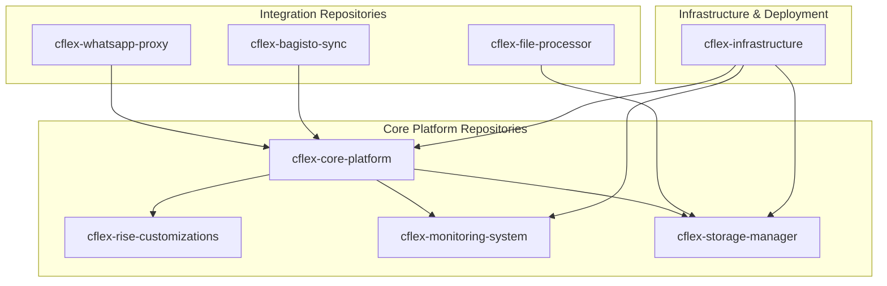
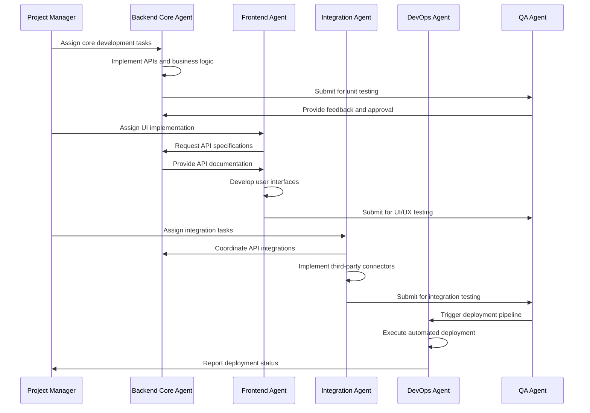
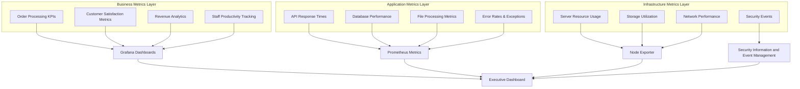

# CFlex Platform Development Strategy & Implementation Roadmap
**Version: 1.0**  
**Date: August 22, 2025**  
**Platform: CFlex Advanced Printing Business Management System**

---

## Executive Summary

This document outlines a comprehensive development strategy for the CFlex platform, a sophisticated printing business management system integrating Rise CRM 3.9.3, advanced monitoring capabilities, and scalable infrastructure utilizing VPS and cPanel storage integration.

### Key Infrastructure Components
- **VPS Server**: 4 vCPU, 6GB RAM, 100GB SSD (Primary application hosting)
- **cPanel Storage**: 1.5TB bulk file storage integration
- **Core Platform**: Rise CRM 3.9.3 with extensive customizations
- **Supporting Systems**: Ever-Gauzy ERP brain, Bagisto e-commerce integration

---

## 1. Repository Architecture & Structure

### 1.1 Repository Ecosystem Overview

The CFlex platform requires **8 primary repositories** with clear separation of concerns and defined interdependencies:



### 1.2 Detailed Repository Specifications

#### Repository 1: `cflex-core-platform`
**Purpose**: Main application orchestrator and business logic coordinator  
**Technology Stack**: Node.js, NestJS, TypeScript  
**Primary Responsibilities**:
- API gateway and service orchestration
- Authentication and authorization management
- Business rule engine implementation
- Database schema management and migrations

**Key Dependencies**:
- Rise CRM 3.9.3 core framework
- MySQL 8.0+ for data persistence
- Redis for session management and caching

**Audit Folder Structure**:
```
/audit/
  ├── agent-progress/
  │   ├── backend-agent-tasks.md
  │   ├── frontend-agent-tasks.md
  │   └── integration-agent-tasks.md
  ├── code-quality/
  │   ├── coverage-reports/
  │   ├── security-scans/
  │   └── performance-benchmarks/
  └── milestones/
      ├── sprint-completions/
      └── release-readiness/
```

#### Repository 2: `cflex-rise-customizations`
**Purpose**: Rise CRM 3.9.3 specific customizations and extensions  
**Technology Stack**: PHP 8.2+, CodeIgniter 4  
**Primary Responsibilities**:
- Custom modules for printing workflow
- Enhanced store module functionality
- Printing-specific pricing engine
- Inventory management extensions

**Implementation Goals**:
- Seamless integration with Rise CRM without core modifications
- Backward compatibility maintenance
- Plugin architecture for future extensibility

**Success Metrics**:
- 100% compatibility with Rise CRM updates
- <500ms response time for pricing calculations
- Zero data corruption during customization deployment

#### Repository 3: `cflex-monitoring-system`
**Purpose**: Advanced monitoring, logging, and observability platform  
**Technology Stack**: Prometheus, Grafana, ELK Stack, Node.js  
**Primary Responsibilities**:
- Real-time performance monitoring
- Business metrics tracking
- Error tracking and alerting
- Log aggregation and analysis

**Key Features**:
- Multi-tier monitoring (infrastructure, application, business)
- Automated anomaly detection
- Predictive scaling recommendations
- Custom dashboard creation for stakeholders

#### Repository 4: `cflex-storage-manager`
**Purpose**: Hybrid storage management system (VPS + cPanel integration)  
**Technology Stack**: Node.js, MinIO, SFTP clients  
**Primary Responsibilities**:
- File upload and processing coordination
- VPS to cPanel storage migration
- File versioning and backup management
- Storage optimization and archival

**Architecture Rationale**:
- VPS storage for active files requiring fast access
- cPanel for archival and backup storage
- Intelligent tiering based on file age and access patterns

#### Repository 5: `cflex-whatsapp-proxy`
**Purpose**: WhatsApp Business API proxy and communication manager  
**Technology Stack**: Node.js, Baileys/WhatsApp-Web.js  
**Primary Responsibilities**:
- WhatsApp message sending and receiving
- Template management and localization
- Failover to email/SMS systems
- Message queue management

**Risk Mitigation**:
- Multiple proxy instances for redundancy
- Automatic reconnection and session management
- Comprehensive fallback mechanisms

#### Repository 6: `cflex-bagisto-sync`
**Purpose**: E-commerce integration and synchronization  
**Technology Stack**: Laravel, PHP, GraphQL  
**Primary Responsibilities**:
- Product catalog synchronization
- Order management integration
- Customer data unification
- AR/VR asset management

#### Repository 7: `cflex-file-processor`
**Purpose**: Advanced file processing and conversion system  
**Technology Stack**: Node.js, Sharp, FFmpeg, ImageMagick  
**Primary Responsibilities**:
- TIFF to JPG conversion with watermarking
- PDF generation and manipulation
- Batch processing capabilities
- Preview generation optimization

#### Repository 8: `cflex-infrastructure`
**Purpose**: Infrastructure as Code and deployment automation  
**Technology Stack**: Docker, Ansible, Bash, YAML  
**Primary Responsibilities**:
- Automated deployment pipelines
- Environment configuration management
- Backup and disaster recovery procedures
- Security hardening automation

---

## 2. Task Allocation Framework for Coding Agents

### 2.1 Agent Specialization Matrix

| Agent Type | Primary Responsibilities | Success Metrics | Deliverables |
|------------|-------------------------|-----------------|--------------|
| **Backend Core Agent** | Core platform development, API design, database management | Code coverage >85%, API response <200ms, Zero SQL injection vulnerabilities | REST APIs, Database schemas, Business logic implementations |
| **Frontend Experience Agent** | UI/UX implementation, responsive design, accessibility | WCAG 2.1 AA compliance, Mobile responsiveness score >95%, User task completion rate >90% | Angular components, CSS frameworks, User interface mockups |
| **Integration Specialist Agent** | Third-party integrations, API connectors, data synchronization | Integration uptime >99.5%, Data sync accuracy 100%, Error rate <0.1% | API connectors, Sync mechanisms, Error handling systems |
| **DevOps Infrastructure Agent** | CI/CD pipelines, monitoring setup, deployment automation | Deployment success rate >98%, Recovery time <5 minutes, Infrastructure uptime >99.9% | Deployment scripts, Monitoring dashboards, Backup procedures |
| **Security Hardening Agent** | Security implementation, vulnerability assessment, compliance | Zero critical vulnerabilities, Security audit score >90%, Compliance verification 100% | Security protocols, Audit reports, Penetration testing results |
| **Quality Assurance Agent** | Testing automation, performance testing, code review | Bug detection rate >95%, Performance benchmarks met, Code quality score >8/10 | Test suites, Performance reports, Quality metrics |

### 2.2 Agent Coordination Workflow



### 2.3 Agent Performance Tracking

Each agent maintains detailed progress logs in repository audit folders:

**Daily Standups**: Automated progress reports generated from git commits and task management systems
**Weekly Reviews**: Comprehensive analysis of deliverables, blockers, and quality metrics
**Sprint Retrospectives**: Agent performance evaluation and process optimization

---

## 3. Open Source Project Research & Evaluation Framework

### 3.1 Systematic Research Methodology

#### Phase 1: Discovery and Cataloging
**Primary Sources**:
- GitHub trending repositories (Node.js, PHP, Laravel)
- NPM/Packagist package registries
- awesome-lists for specific technologies
- Industry-specific software directories

**Evaluation Criteria Matrix**:
| Criteria | Weight | Scoring Method |
|----------|--------|----------------|
| **Community Activity** | 25% | Commits, issues, stars, forks |
| **Documentation Quality** | 20% | Completeness, examples, API reference |
| **Security Track Record** | 20% | CVE history, security audits |
| **Performance Benchmarks** | 15% | Load testing results, resource usage |
| **Integration Complexity** | 10% | Setup difficulty, dependency conflicts |
| **License Compatibility** | 10% | Commercial use, modification rights |

#### Phase 2: Technical Assessment
**Code Quality Analysis**:
- Automated code quality scanning (SonarQube)
- Dependency vulnerability assessment
- Performance profiling under load
- Security penetration testing

**Integration Testing**:
- Proof of concept implementations
- Resource consumption measurement
- Compatibility verification with existing stack

#### Phase 3: Strategic Alignment Review
**Business Impact Assessment**:
- Feature alignment with requirements
- Maintenance overhead estimation
- Scalability potential analysis
- Vendor lock-in risk evaluation

### 3.2 Open Source Component Recommendations

Based on systematic evaluation, here are the recommended components:

#### Monitoring & Logging Stack
**Primary Choice**: Prometheus + Grafana + ELK Stack
- **Reasoning**: Industry standard, excellent documentation, strong community
- **Alternative**: Netdata + LogDNA (lighter resource footprint)
- **Integration Strategy**: Containerized deployment on VPS, metrics forwarding from cPanel

#### File Processing Engine
**Primary Choice**: Sharp.js + libvips
- **Reasoning**: Superior performance for image processing, lower memory usage
- **Alternative**: ImageMagick (fallback for complex operations)
- **Integration Strategy**: Queue-based processing with automatic failover

#### Communication Systems
**Primary Choice**: Baileys (WhatsApp) + SendGrid (Email)
- **Reasoning**: Most stable unofficial WhatsApp API, reliable email delivery
- **Alternative**: WPPConnect + Mailgun
- **Integration Strategy**: Multi-channel redundancy with automatic failover

---

## 4. Technical Architecture & Infrastructure Design

### 4.1 Security Framework

#### Multi-Layer Security Implementation
```
┌─────────────────────────────────────────┐
│           Application Security          │
├─────────────────────────────────────────┤
│     • JWT Authentication               │
│     • Role-based Access Control        │
│     • Input Validation & Sanitization  │
│     • SQL Injection Prevention         │
└─────────────────────────────────────────┘
┌─────────────────────────────────────────┐
│          Infrastructure Security        │
├─────────────────────────────────────────┤
│     • TLS 1.3 Encryption              │
│     • Firewall Configuration           │
│     • Intrusion Detection System       │
│     • Regular Security Updates         │
└─────────────────────────────────────────┘
┌─────────────────────────────────────────┐
│             Data Security              │
├─────────────────────────────────────────┤
│     • AES-256 Encryption at Rest       │
│     • Database Access Controls         │
│     • Audit Logging                    │
│     • Backup Encryption                │
└─────────────────────────────────────────┘
```

#### Security Protocols Implementation
- **Authentication**: Multi-factor authentication for admin accounts
- **Authorization**: Granular role-based permissions with least privilege principle
- **Data Protection**: End-to-end encryption for sensitive customer data
- **Audit Trail**: Immutable logging of all critical operations

### 4.2 Scalability Architecture

#### Horizontal Scaling Strategy
**Phase 1**: Single VPS deployment with optimized resource utilization
**Phase 2**: Load balancer introduction with multiple VPS instances
**Phase 3**: Microservices decomposition for specific high-load components

#### Performance Optimization Techniques
- **Database Optimization**: Read replicas, query optimization, indexing strategy
- **Caching Strategy**: Redis for session data, CDN for static assets
- **File Storage Optimization**: Intelligent tiering between VPS and cPanel storage
- **API Optimization**: GraphQL for efficient data fetching, response compression

### 4.3 Disaster Recovery & Business Continuity

#### Backup Strategy
**Tier 1 - Critical Data (Daily)**:
- Database full backup to encrypted storage
- Configuration files and secrets backup
- Critical file uploads backup

**Tier 2 - Business Data (Weekly)**:
- Complete file system backup
- Application code repositories
- Monitoring and log data

**Tier 3 - Archival Data (Monthly)**:
- Historical transaction data
- Audit logs older than 90 days
- Legacy file formats and conversions

#### Recovery Procedures
**RTO (Recovery Time Objective)**: 4 hours for complete system restoration
**RPO (Recovery Point Objective)**: 24 hours maximum data loss
**Automated Recovery**: Self-healing mechanisms for common failure scenarios

---

## 5. Advanced Monitoring & Logging System Design

### 5.1 Multi-Tier Monitoring Architecture



### 5.2 Monitoring Implementation Strategy

#### Business Intelligence Monitoring
- **Real-time KPI Tracking**: Order completion rates, customer satisfaction scores
- **Predictive Analytics**: Demand forecasting, capacity planning
- **Performance Benchmarking**: Staff productivity, system efficiency metrics

#### Technical Performance Monitoring
- **Application Performance Monitoring (APM)**: New Relic or self-hosted equivalent
- **Infrastructure Monitoring**: Prometheus + Node Exporter for system metrics
- **Log Aggregation**: ELK Stack for centralized logging and analysis

#### Alerting Framework
- **Critical Alerts**: System downtime, security breaches, data corruption
- **Warning Alerts**: Performance degradation, capacity thresholds
- **Informational Alerts**: Deployment completions, backup status

### 5.3 Logging Strategy

#### Structured Logging Implementation
```json
{
  "timestamp": "2025-08-22T10:30:00Z",
  "level": "INFO",
  "service": "cflex-core-platform",
  "component": "order-processor",
  "action": "order_created",
  "user_id": "user_123",
  "order_id": "order_456",
  "metadata": {
    "ip_address": "192.168.1.100",
    "user_agent": "Mozilla/5.0...",
    "processing_time": 234
  }
}
```

#### Log Retention Policies
- **Security Logs**: 7 years retention (compliance requirement)
- **Application Logs**: 1 year retention with archival
- **Debug Logs**: 30 days retention in production
- **Audit Logs**: Permanent retention with encryption

---

## 6. Implementation Timeline & Project Roadmap

### 6.1 Project Phases Overview

#### Phase 1: Foundation Setup (Weeks 1-4)
**Milestone**: Infrastructure Ready & Core Framework Deployed

**Week 1-2: Infrastructure Preparation**
- VPS server configuration and hardening
- cPanel storage integration setup
- CI/CD pipeline establishment
- Development environment creation

**Week 3-4: Core Platform Setup**
- Rise CRM 3.9.3 deployment and customization
- Database schema design and implementation
- Basic authentication and authorization setup
- Repository structure creation and agent onboarding

**Risk Assessment**: Medium risk due to infrastructure complexity
**Contingency Plan**: Pre-configured backup VPS available for rapid deployment

#### Phase 2: Core Development (Weeks 5-12)
**Milestone**: Core Business Logic Implemented

**Week 5-6: Order Management System**
- Product catalog implementation
- Dynamic pricing engine development
- Order workflow automation
- Task queue system creation

**Week 7-8: File Management System**
- File upload and processing implementation
- TIFF to JPG conversion system
- Storage tier management
- Preview generation optimization

**Week 9-10: Communication Framework**
- WhatsApp proxy setup and testing
- Email template system implementation
- Multi-language support integration
- Notification queue management

**Week 11-12: Financial Management**
- Invoice generation automation
- Payment tracking system
- Credit management implementation
- Basic reporting framework

**Risk Assessment**: High complexity with multiple integration points
**Contingency Plan**: Prioritized feature development with MVP fallback options

#### Phase 3: Integration & Enhancement (Weeks 13-20)
**Milestone**: Fully Integrated System with E-commerce

**Week 13-14: E-commerce Integration**
- Bagisto platform setup and customization
- Product synchronization implementation
- Customer data unification
- AR/VR viewer integration

**Week 15-16: Advanced Monitoring**
- Monitoring system deployment
- Business intelligence dashboard creation
- Alerting framework implementation
- Performance optimization

**Week 17-18: Security Hardening**
- Security audit and penetration testing
- Compliance verification
- Backup and recovery testing
- Documentation completion

**Week 19-20: Performance Optimization**
- Load testing and optimization
- Scaling preparation
- Final integration testing
- Go-live preparation

#### Phase 4: Deployment & Stabilization (Weeks 21-24)
**Milestone**: Production System Live and Stable

**Week 21-22: Soft Launch**
- Limited user beta testing
- Feedback collection and implementation
- Staff training and onboarding
- Issue resolution

**Week 23-24: Full Production Launch**
- Complete data migration
- Full user onboarding
- Monitoring and support activation
- Performance baseline establishment

### 6.2 Risk Assessment & Mitigation Strategies

#### High-Risk Areas

**Risk 1: WhatsApp Proxy Stability**
- **Impact**: Critical communication channel failure
- **Probability**: Medium (30%)
- **Mitigation**: 
  - Multiple proxy instances with load balancing
  - Automatic failover to email/SMS systems
  - Continuous monitoring and health checks
  - Backup communication channels always ready

**Risk 2: cPanel Storage Integration Complexity**
- **Impact**: File processing delays and storage issues
- **Probability**: Medium (25%)
- **Mitigation**:
  - Comprehensive testing in staging environment
  - SFTP connection pooling and retry mechanisms
  - Local VPS caching for frequently accessed files
  - Alternative cloud storage integration ready

**Risk 3: Performance Under Load**
- **Impact**: System slowdown affecting user experience
- **Probability**: Low (15%)
- **Mitigation**:
  - Extensive load testing during development
  - Performance monitoring and alerting
  - Horizontal scaling architecture ready
  - Database optimization and caching strategies

**Risk 4: Staff Adoption Resistance**
- **Impact**: Reduced system utilization and ROI
- **Probability**: Medium (20%)
- **Mitigation**:
  - Comprehensive training program
  - Phased rollout with champions program
  - Continuous support and feedback collection
  - User experience optimization based on feedback

### 6.3 Success Metrics & KPIs

#### Technical Performance KPIs
- **System Uptime**: >99.5% availability
- **Response Time**: <3 seconds for 95% of requests
- **File Processing**: <60 seconds for 90% of files under 50MB
- **Error Rate**: <0.1% for critical operations

#### Business Performance KPIs
- **Order Processing Efficiency**: 60% reduction in manual processing time
- **Customer Satisfaction**: >90% approval rating for new system
- **Staff Productivity**: 40% increase in orders processed per day
- **Revenue Impact**: 25% increase in throughput capacity

#### Quality Assurance KPIs
- **Code Coverage**: >85% for critical components
- **Security Compliance**: Zero critical vulnerabilities
- **Documentation Coverage**: 100% for public APIs
- **Test Automation**: >90% of functionality covered by automated tests

---

## 7. Documentation Gaps & Additional Requirements

### 7.1 Identified Specification Gaps

Based on my analysis of the existing documentation, the following areas require additional clarification:

#### Business Process Gaps
1. **Conflict Resolution Procedures**: How to handle disputes between customers and staff regarding design quality or delivery timelines
2. **Pricing Override Approval Workflow**: Detailed approval chain for price modifications beyond defined thresholds
3. **Emergency Order Handling**: Procedures for orders requiring completion outside business hours
4. **Quality Control Standards**: Specific criteria for design approval and rejection

#### Technical Implementation Gaps
1. **Backup Verification Procedures**: Automated testing of backup integrity and restoration procedures
2. **Performance Baseline Metrics**: Specific performance targets for different system components
3. **Security Incident Response Plan**: Detailed procedures for handling security breaches
4. **Capacity Planning Guidelines**: Specific metrics for determining when system scaling is required

### 7.2 Recommended Additional Documentation

#### Operations Manual
- **Daily Operations Checklist**: Step-by-step procedures for staff
- **Troubleshooting Guide**: Common issues and resolution procedures
- **Emergency Contact Procedures**: Escalation paths for critical issues

#### Technical Documentation
- **API Documentation**: Complete REST API reference with examples
- **Database Schema Documentation**: Detailed ERD with relationship explanations
- **Deployment Guide**: Step-by-step deployment and rollback procedures

---

## 8. Conclusion & Next Steps

This comprehensive development strategy provides a structured approach to implementing the CFlex platform with advanced monitoring and logging capabilities. The 8-repository architecture ensures clear separation of concerns while maintaining strong integration points.

### Immediate Action Items
1. **Repository Setup**: Create all 8 repositories with defined structure and documentation
2. **Agent Onboarding**: Recruit and train specialized coding agents according to the framework
3. **Infrastructure Preparation**: Begin VPS and cPanel configuration
4. **Open Source Evaluation**: Start systematic evaluation of recommended components

### Success Factors
- **Clear Communication**: Regular stakeholder updates and agent coordination
- **Incremental Delivery**: Frequent deployments with immediate feedback
- **Quality Focus**: Continuous testing and monitoring throughout development
- **Risk Management**: Proactive identification and mitigation of potential issues

The proposed timeline of 24 weeks provides adequate time for thorough development, testing, and deployment while maintaining quality standards and risk mitigation strategies.
