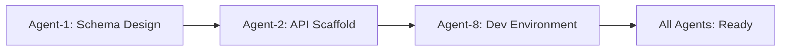
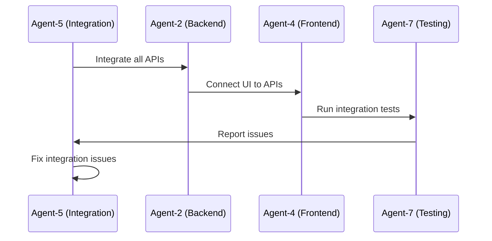

# Global Workflow Orchestration System
**Version: 2.0**  
**Date: August 23, 2025**  
**Purpose: Coordinate 8 specialized coding agents for CFlex platform development**

---

## Agent Architecture Overview

Based on PRD consolidate v3.md requirements, we have decomposed the system into 8 specialized agents, each with focused expertise and clear boundaries. This approach ensures:
- **Atomic Tasks**: Each agent receives self-contained, executable tasks
- **Clear Dependencies**: Explicit input/output contracts between agents
- **Parallel Execution**: Multiple agents can work simultaneously on non-dependent tasks
- **Quality Gates**: Each agent validates their work before handoff

---

## Agent Specializations

### Agent 1: Database Architect
**Domain**: Database schema, migrations, data integrity  
**Skills**: MySQL 8.0, database optimization, indexing strategies  
**Primary Repository**: cflex-core-platform (database layer)

### Agent 2: Backend API Developer
**Domain**: REST APIs, business logic, authentication  
**Skills**: Node.js/NestJS or PHP/CodeIgniter (Rise CRM)  
**Primary Repository**: cflex-rise-customizations, cflex-core-platform

### Agent 3: File Processing Specialist
**Domain**: File conversions, image processing, storage management  
**Skills**: Sharp.js, ImageMagick, SFTP, MinIO  
**Primary Repository**: cflex-file-processor, cflex-storage-manager

### Agent 4: Frontend UI Developer
**Domain**: User interfaces, responsive design, accessibility  
**Skills**: Angular/React, Bootstrap, WCAG compliance  
**Primary Repository**: cflex-core-platform (frontend)

### Agent 5: Integration Engineer
**Domain**: Third-party APIs, WhatsApp proxy, email services  
**Skills**: API integration, webhooks, message queuing  
**Primary Repository**: cflex-whatsapp-proxy, cflex-bagisto-sync

### Agent 6: Monitoring Specialist
**Domain**: Observability, logging, dashboards, alerts  
**Skills**: Prometheus, Grafana, Loki, alerting  
**Primary Repository**: cflex-monitoring-system

### Agent 7: Testing Automation Engineer
**Domain**: Unit tests, integration tests, E2E tests, performance tests  
**Skills**: Jest, PHPUnit, Selenium, JMeter  
**Primary Repository**: All (testing layer)

### Agent 8: DevOps Engineer
**Domain**: CI/CD, deployment, infrastructure, security  
**Skills**: Docker, GitHub Actions, Ansible, security hardening  
**Primary Repository**: cflex-infrastructure

---

## Workflow Execution Phases

### Phase 0: Initialization (Week 0)
**Coordinator**: Human Project Manager
**Actions**:
1. Review PRD/consolidate v3.md requirements
2. Assign initial tasks to each agent
3. Set up communication channels
4. Initialize agent memory stores

### Phase 1: Foundation (Weeks 1-2)
**Critical Path**: Agent-1 → Agent-2 → Agent-8



**Parallel Tracks**:
- Agent-6: Set up monitoring infrastructure
- Agent-7: Create test framework
- Agent-4: UI mockups and components

### Phase 2: Core Development (Weeks 3-8)
**Critical Path**: Multiple parallel streams

```mermaid
graph TB
    subgraph Stream1[Order Management]
        A1[Agent-1: Order Tables] --> A2[Agent-2: Order APIs]
        A2 --> A4[Agent-4: Order UI]
        A4 --> A7[Agent-7: Order Tests]
    end
    
    subgraph Stream2[File Processing]
        B1[Agent-3: Upload Handler] --> B2[Agent-3: Conversion Pipeline]
        B2 --> B5[Agent-5: Storage Integration]
        B5 --> B7[Agent-7: File Tests]
    end
    
    subgraph Stream3[Communication]
        C5[Agent-5: WhatsApp Proxy] --> C2[Agent-2: Notification APIs]
        C2 --> C7[Agent-7: Comm Tests]
    end
```



### Phase 3: Integration (Weeks 9-12)
**Critical Path**: Agent-5 leads integration



### Phase 4: Optimization (Weeks 13-16)
**Focus**: Performance, security, monitoring

- Agent-6: Complete dashboards and alerts
- Agent-7: Performance testing
- Agent-8: Security hardening
- Agent-3: Storage optimization

### Phase 5: Deployment (Weeks 17-20)
**Lead**: Agent-8 with support from all agents

---

## Task Distribution Protocol

### Task Format
```yaml
task_id: "T-001-DB-001"
agent: "agent-1-database"
priority: "critical"
dependencies: []
estimated_hours: 8
acceptance_criteria:
  - Schema created with proper indexes
  - Migration scripts tested
  - Performance benchmarks met
deliverables:
  - migrations/001_create_orders.sql
  - docs/database_design.md
  - test_results/performance.json
```

### Task Assignment Rules
1. **Atomic Tasks**: Each task must be completable in 1-3 days
2. **Clear Inputs**: All required information provided upfront
3. **Testable Outputs**: Deliverables must be verifiable
4. **No Ambiguity**: Specific technologies and approaches defined

---

## Inter-Agent Communication

### Handoff Protocol
```json
{
  "handoff_id": "H-001",
  "from_agent": "agent-1-database",
  "to_agent": "agent-2-backend-api",
  "timestamp": "2025-08-23T10:00:00Z",
  "artifacts": [
    "migrations/001_create_orders.sql",
    "docs/schema.md"
  ],
  "context": {
    "tables_created": ["orders", "order_items"],
    "indexes": ["idx_order_date", "idx_customer_id"],
    "notes": "Optimized for read-heavy workload"
  },
  "next_action": "Create CRUD APIs for order management"
}
```

### Dependency Resolution
- **Blocking Dependencies**: Must wait for upstream agent
- **Soft Dependencies**: Can proceed with mocks/stubs
- **Parallel Work**: Independent tasks execute concurrently

---

## Quality Gates

### Per-Task Validation
1. **Code Review**: Automated + peer review
2. **Test Coverage**: >85% for critical paths
3. **Documentation**: Updated with changes
4. **Performance**: Meets defined SLAs

### Sprint Gates
- **Week 2**: Foundation complete
- **Week 4**: Core features functional
- **Week 8**: Integration complete
- **Week 12**: Performance validated
- **Week 16**: Security certified
- **Week 20**: Production ready

---

## Agent Memory System

### Memory Structure
```
agents/{agent-name}/memory/
├── context.json          # Current context and state
├── learned_patterns.json # Successful patterns to reuse
├── error_log.json        # Mistakes to avoid
├── dependencies.json     # Known dependencies
└── preferences.json      # Coding style preferences
```

### Context Persistence
- **Session Memory**: Current task context
- **Long-term Memory**: Patterns, preferences, lessons learned
- **Shared Memory**: Inter-agent knowledge base

---

## Audit Trail System

### Audit Entry Format
```json
{
  "timestamp": "2025-08-23T10:00:00Z",
  "agent": "agent-2-backend-api",
  "task_id": "T-002-API-001",
  "action": "completed",
  "duration_hours": 6.5,
  "deliverables": [
    "src/api/orders/controller.js",
    "tests/api/orders.test.js"
  ],
  "metrics": {
    "lines_of_code": 450,
    "test_coverage": 92,
    "complexity": 8
  },
  "issues_encountered": [],
  "knowledge_gained": "Use middleware for validation"
}
```

---

## Coordination Rules

### Daily Sync Protocol
1. **Morning Check-in** (9:00 AM)
   - Each agent reports status
   - Identify blockers
   - Adjust priorities

2. **Midday Progress** (1:00 PM)
   - Progress updates
   - Help requests
   - Resource sharing

3. **Evening Handoff** (5:00 PM)
   - Completed deliverables
   - Next day planning
   - Knowledge sharing

### Escalation Path
1. **Level 1**: Inter-agent resolution
2. **Level 2**: Lead agent intervention
3. **Level 3**: Human project manager
4. **Level 4**: Stakeholder decision

---

## Success Metrics

### Agent Performance KPIs
- **Task Completion Rate**: >95%
- **Quality Score**: >90%
- **Rework Rate**: <10%
- **Knowledge Retention**: >80%

### Project KPIs
- **Velocity**: Story points per sprint
- **Defect Rate**: <5 per 1000 LOC
- **Test Coverage**: >85%
- **Documentation**: 100% API coverage

---

## Contingency Protocols

### Agent Failure Handling
1. **Timeout**: If agent doesn't respond in 4 hours
2. **Reassignment**: Task moves to backup agent
3. **Escalation**: Critical tasks escalate immediately

### Dependency Deadlock Resolution
1. **Detection**: Monitor for circular dependencies
2. **Breaking**: Introduce mock/stub to break cycle
3. **Resolution**: Prioritize critical path

---

## Reference Architecture Adaptation

Based on PRD consolidate v3.md, we adapt existing open-source projects:
- **Rise CRM 3.9.3**: Base platform (don't modify core)
- **Ever-Gauzy**: Reference for ERP patterns
- **Bagisto**: E-commerce integration patterns
- **n8n.io**: Workflow automation patterns

Each agent references these but creates CFlex-specific implementations.

---

## Next Steps

1. Initialize each agent workspace
2. Load PRD requirements into agent memory
3. Create first sprint task backlog
4. Begin Phase 1 execution
5. Monitor and adjust based on agent performance
